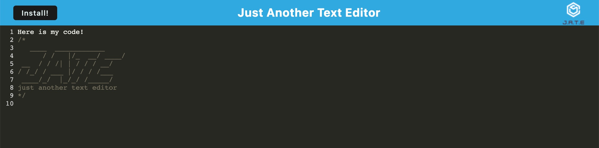

# PWA Text Editor

## Table of Contents

[Description](#description)

[Visuals](#visuals)

[Contributing](#contributing)

## Description

This application is a text editor that runs in the browser (deployed using Heroku). The editor is designed for code that persists even after the browser is refreshed and can continue to hold information when offline.

## Visuals

Heroku URL: https://github.com/dstelzl/pwa-text-editor

## Contributing

Completed by Deborah Stelzl